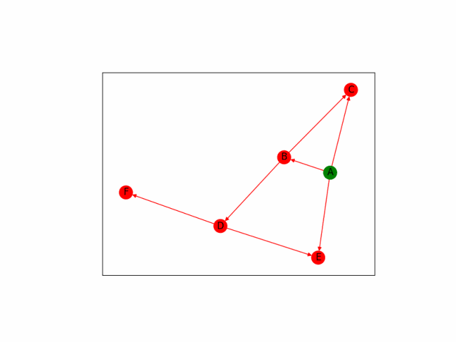

# Graph animation

This is my student project for a python programming course at SPbSTU.
The task is to make a visuaization of two graph search algorithms (depth-first and breadth-first), using any graph visualization library. I have chosen networkx, since it allowes to draw graphs inside given matplotlib axes. That enables me to create animation right inside the program and output is as .gif file.

## Installation
After cloning the repository, run
```
pip install -r requirement.txt
```
## Examples
Let's visualize the depth first search on a simple graph.
First, we need to create a networkx graph:
```
import networkx

graph = nx.DiGraph()

graph.add_edge('A', 'B')
graph.add_edge('A', 'C')
graph.add_edge('B', 'C')
graph.add_edge('D', 'E')
graph.add_edge('A', 'E')
graph.add_edge('B', 'D')
graph.add_edge('D', 'F')
```
Next, we get the frames of a future animation, using function __make_depth_first_search_frames__ from __depth_first_animation__ package and create animation object with function __make_animation__ from __utils__:
```
from .utils import make_animation
from .depth_first_animation import make_depth_first_search_frames

frames = make_depth_first_search_frames(graph, 'A')
anim = make_animation(frames)
```
Last, we save the animation into a .gif file, using function __save_animation__ from __utils__ package:
```
from .utils import save_animation

save_animation(anim, 'result.gif', fps=3)
```
This is the output we get:



See more [here](examples)
