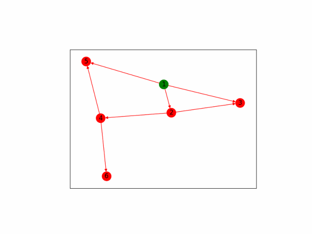

# Graph animation

This is my student project for a python programming course at SPbSTU.
The task is to make a visuaization of two graph search algorithms (depth-first and breadth-first), using any graph visualization library. I have chosen networkx, since it allowes to draw graphs inside given matplotlib axes. That enables me to create animation right inside the program and output is as .gif file.

## Installation
After cloning the repository, run
```
pip install -r requirement.txt
```
## Examples
Let's visualize the depth first search on a simple graph.
First, we need to create a file, that contains the graph as a list of edges. Here we will use [examples/edgelist.txt](examples/edgelist.txt):
```
1 2
1 3
2 3
4 5
1 5
2 4
4 6
```
Next, we execute src/run.py as follows:
```
run.py algorithm input_path start_node output_path
```
Which with our parameters becomes:
```
run.py depth_first ../examples/edgelist.txt 1 ../examples/df_output.gif
```
This is the output we get:



See more [here](examples)
